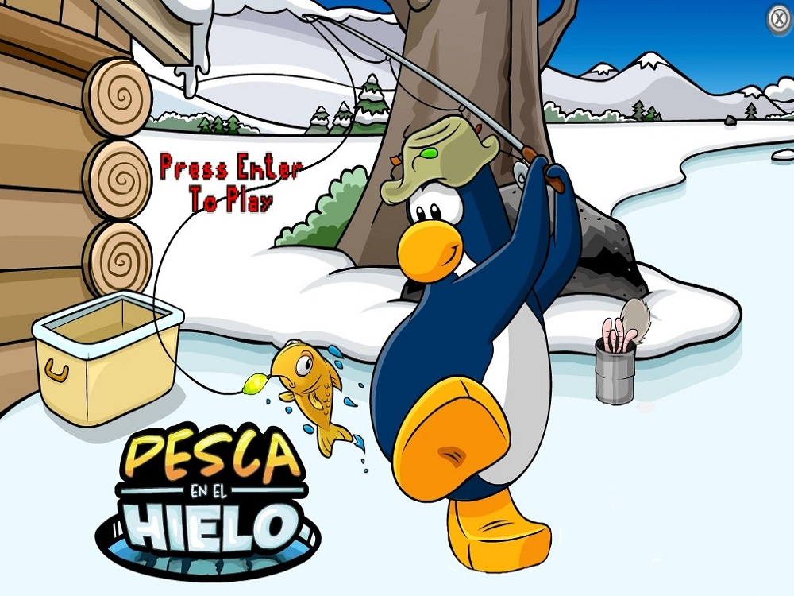

# Pesca en el Hielo

## Equipo de desarrollo

- Lucas Lamanna
- Stephanie Wasiuchnik
- Nicolas Galfione
- Juan Furlan
- Tobias Ducrot

## Capturas

## Reglas de Juego / Instrucciones

El juego consiste en pescar la mayor cantidad de peces posibles pero CUIDADO! Empezaras con 3 gusanos como vida, estas se te iran restando 
a medida que vayas pescando cosas como basura (descuenta 1 vida), medusa (descuenta 1 vida y te paraliza durante 1,5 segundos) y por ultimo 
el temible tiburon, este te hara perder inmediatamente el juego asi que ten mucho cuidado.

PD: no todo es malo! tambien podras pescar una lata de gusano que haran que tus gusanos aumenten, con un maximo de 3

## Otros

- Facultad: UTN FRBA
- Curso: K2002
- Versión de wollok: 3.0.0
- No tenemos problema con que sea publico!
