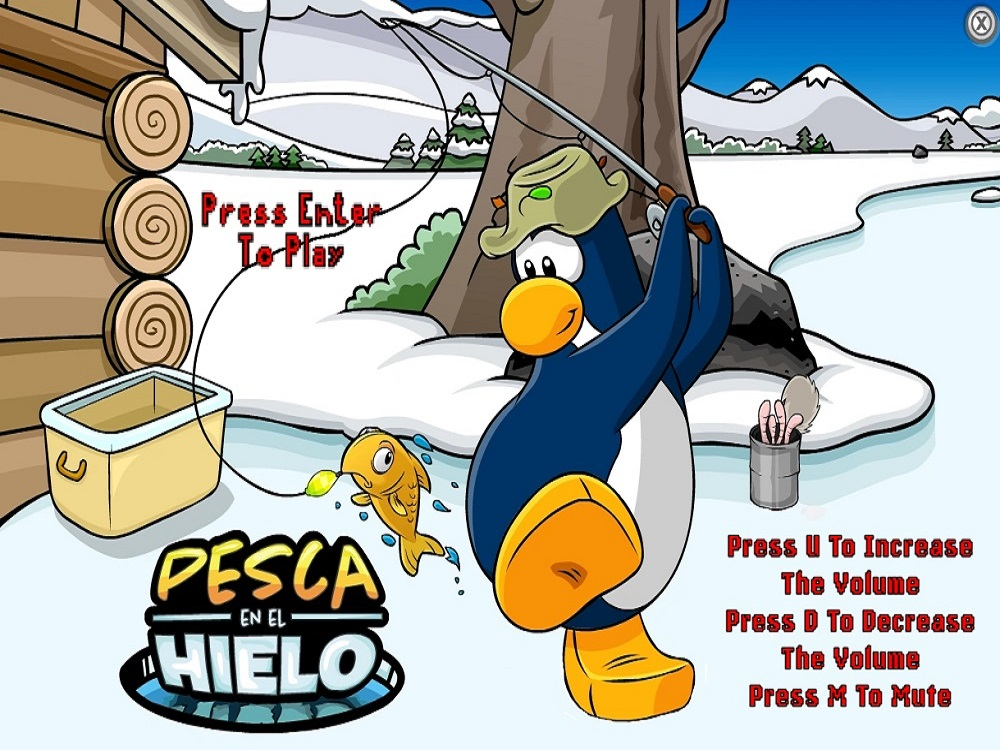

# Pesca en el Hielo

## Equipo de desarrollo

- Lucas Lamanna
- Stephanie Wasiuchnik
- Nicolas Galfione
- Juan Furlan
- Tobias Ducrot

## Capturas

## Reglas de Juego / Instrucciones

El juego consiste en pescar la mayor cantidad de peces posibles pero CUIDADO! Empezaras con 3 gusanos como vida, estas se te iran restando 
a medida que vayas pescando cosas como basura (descuenta 1 vida), medusa (descuenta 1 vida y te paraliza durante 1,5 segundos),un temible tiburon, 
este te hara perder inmediatamente el juego asi que ten mucho cuidado y tambien puedes cruzarte con algun pulpo, que no solo te descontara 1 vida sino que
manchara toda tu pantalla (y a ti tambien) haciendo que se te dificulte ver. Además, hay que tener cuidado con el cengrejo que con las pinzas te puede cortar
el hilo y te quedas sin caña.

PD: no todo es malo! tambien podras pescar una lata de gusano que haran que tus gusanos aumenten, con un maximo de 3. Y no te preocupes por las manchas, 
mucha gente ademas de arrojar basura al mar tambien desecha ciertos objetos utiles; puedes pescar un quita manchas para limpiarte y limpiar tambien tu vista.

## Otros

- Facultad: UTN FRBA
- Curso: K2002
- Versión de wollok: 3.0.0
- No tenemos problema con que sea publico!
